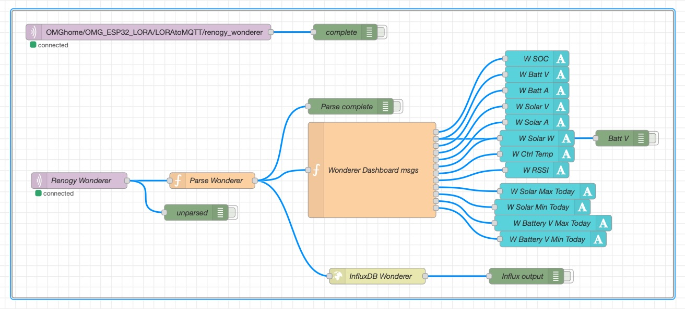

# ESP32-S3 XIAO Renogy LoRa

A standalone LoRa transmitter that reads data from a Renogy solar charge controller via RS232 Modbus and transmits it wirelessly to an OpenMQTTGateway (OMG) LoRa gateway. Built for remote monitoring where WiFi is unavailable or impractical.

This is the **Seeed Studio XIAO ESP32-S3 + Wio-SX1262 LoRa Kit** version of the project. The kit's LoRa board plugs directly onto the XIAO, so there's no LoRa wiring, and the whole unit is smaller and cheaper than a DevKit plus a separate LoRa breakout.

> Looking for the original ESP32 DevKit1 + Adafruit RFM95W version? See [ESP32-Renogy-LoRa](https://github.com/billjuv/ESP32-Renogy-LoRa). Both versions send the same payload with the same LoRa settings, so they work with the same gateway and the same Node-RED / MQTT setup.

Tested with:

- Renogy Wanderer 10A PWM (RNG-CTRL-WND10)
- Renogy Rover 20A MPPT (tested with the DevKit version; the Modbus code is identical)

Should work with any Renogy charge controller that has an RS232 RJ12 port.

> Note: This project covers RS232 controllers only. Renogy also makes controllers with RS485 ports, which use a different converter (MAX485) and require DE/RE pin toggling in the firmware. The Modbus registers and LoRa transmission code should be largely the same — community contributions for RS485 support are welcome.

---

## How It Works

The XIAO polls the charge controller about every 60 seconds via Modbus RTU over RS232 (through a MAX3232 level converter), builds a JSON payload, and transmits it via LoRa. The OMG gateway receives the packet and publishes it to MQTT, where it can be picked up by Node-RED, InfluxDB, and Grafana.

```
Renogy controller → RJ12/RS232 → MAX3232 → XIAO ESP32-S3 → Wio-SX1262 → LoRa RF → OMG gateway → MQTT
```

A hardware watchdog reboots the XIAO automatically if a Modbus or LoRa operation ever hangs, so the unit recovers without a manual power cycle.

---

## Hardware

- Seeed Studio XIAO ESP32-S3 + Wio-SX1262 LoRa Kit [(915MHz, B2B connector version)](https://www.seeedstudio.com/Wio-SX1262-with-XIAO-ESP32S3-p-5982.html?srsltid=AfmBOoogf2tGbOi46uP2sMmXXRjYaHeICa5PO6nOsImP6Z5di_YLacmd)
- MAX3232 TTL/RS232 converter board — [(Amazon link)](https://www.amazon.com/dp/B091TN2ZPY)
- MP1584EN DC-DC buck converter — Adjusted to step Renogy RJ12 voltage down to 5V to power the XIAO [(Amazon link)](https://www.amazon.com/dp/B01MQGMOKI)
- RJ12 socket and breakout board — [(Amazon link)](https://www.amazon.com/dp/B0B9BHX7T3?ref_=ppx_hzsearch_conn_dt_b_fed_asin_title_2)))
- RJ12 6-wire cable — [(Amazon link)](https://www.amazon.com/dp/B0F9YVVG77)

Related:
- OMG LoRa Gateway — [(LILYGO LoRa32 915MHz ESP32 Development Board)](https://www.amazon.com/LILYGO-LoRa32-433Mhz-Development-Paxcounter/dp/B09SHRWVNB/ref=sr_1_1?dib=eyJ2IjoiMSJ9.AtA4SX5sQMRx9EvaArXKy60QZlmmxk9hImRj-x_Qk8rvBFpeO9muThruuULU-846Vx-3iCq7dWMWCl_yu2j2Khe3-p4Iab3rjYUMJ7dX-M3n50LaZSgEfWAGOmWnz7vc_I-ep0rsEZm0i6qEFLWm9ylQfEWX7wuf_1JmnFbK5WCITDXlXins-bcn0Slu2RqrZP-2AnFuwnji3k1hDXQRNW7JcEHHeEA6zz5iRrNZ62s.xW7aiOYN-sqfYSBU11yUh3eUZPZGGErpU2juy_AMUO0&dib_tag=se&keywords=ttgo%2Besp32%2Blora&qid=1775087725&sr=8-1&th=1)

---

## Wiring

### Breadboard Example


### RJ12 to MAX3232 (RS232 side)

Pins counted right-to-left with contacts facing you.

| RJ12 Pin | Signal        | MAX3232 RS232 side |
| -------- | ------------- | ------------------ |
| Pin 1    | Controller TX | RXD                |
| Pin 2    | Controller RX | TXD                |
| Pin 3    | GND           | GND                |
| Pin 4    | GND           | GND                |
| Pin 5    | PWR           | +11–15V \*         |
| Pin 6    | PWR           | +11–15V \*         |

\* ~11V on Wanderer 10A, ~15V on Rover 20A

> ⚠️ Never connect RS232 lines directly to the XIAO — the voltage levels will damage it. Always use the MAX3232 converter.

> ⚠️ Never plug a USB cable from your computer into the XIAO for programming while the board is also powered from the controller's RJ12 port. This could damage your computer.

### MAX3232 (TTL side) to XIAO ESP32-S3

| MAX3232 TTL | XIAO Pin | GPIO    |
| ----------- | -------- | ------- |
| TX          | D7 (RX)  | GPIO 44 |
| RX          | D6 (TX)  | GPIO 43 |
| VCC         | 3V3      | —       |
| GND         | GND      | —       |

> If Modbus reads fail with error `0xE2` (timeout) after wiring, the first thing to check is whether TX and RX are swapped.

### Wio-SX1262 LoRa board

No wiring needed — it plugs onto the XIAO through the kit's B2B connector. For reference, the pins used in `main.cpp` are:

| Wio-SX1262 | XIAO GPIO |
| ---------- | --------- |
| NSS (CS)   | GPIO 41   |
| DIO1       | GPIO 39   |
| RESET      | GPIO 42   |
| BUSY       | GPIO 40   |
| SCK / MISO / MOSI | GPIO 7 / 8 / 9 (XIAO default SPI) |

---

## Power

Both controllers have been tested using their RJ12 RS232 port (pins 5–6) to power the board via a buck converter, with the buck converter's 5V output going to the XIAO's **5V** pin:

| Controller   | RJ12 Voltage | Notes                               |
| ------------ | ------------ | ----------------------------------- |
| Wanderer 10A | ~11.3V       | Step down to 5V with buck converter |
| Rover 20A    | ~15.1V       | Step down to 5V with buck converter |

> ⚠️ Do NOT connect RJ12 power pins directly to the XIAO — the voltage will damage it. Always use a buck converter to step down to 5V first, and set its output voltage **before** connecting the XIAO.

---

## Modbus Settings

Both controllers tested at:

- **Baud rate:** 9600
- **Slave address:** 0xFF

> Note: The default documented slave address for Renogy controllers is 0x01, but both units tested here responded to 0xFF. If you get no response, use the included scan utility to find your controller's address.

---

## LoRa Settings

Matched to an existing OpenMQTTGateway LoRa gateway (same as the DevKit version):

| Setting          | Value   |
| ---------------- | ------- |
| Frequency        | 915 MHz |
| Spreading Factor | SF7     |
| Bandwidth        | 125 kHz |
| Coding Rate      | 4/5     |
| Preamble Length  | 8       |
| Sync Word        | 0x12    |
| CRC              | On      |
| Output Power     | 14 dBm  |

> The SX1262 on this kit uses the [RadioLib](https://github.com/jgromes/RadioLib) library instead of the `sandeepmistry/LoRa` library used by the RFM95W version. RadioLib translates sync word `0x12` so the SX1262 stays compatible with SX127x-based gateways like the LILYGO LoRa32.

---

## MQTT Output

The transmitter publishes to your OMG gateway, which forwards to MQTT. OMG looks for the `"value"` field in the payload to create a dedicated subtopic automatically (the name is set in `main.cpp` — change as desired (*I'm keeping the misspelled "wonderer", as opposed to "wanderer")):

**Topic:**

```
OMGhome/OMG_ESP32_LORA/LORAtoMQTT/renogy_wonderer
```

**Payload example:**

```json
{
  "value": "renogy_wonderer",
  "id": "renogy_wonderer",
  "batt_v": 13.2,
  "batt_a": 0.09,
  "soc": 100,
  "solar_v": 13.6,
  "solar_a": 0.07,
  "solar_w": 1,
  "batt_t": 0,
  "ctrl_t": 25,
  "solar_w_max": 51,
  "solar_w_min": 0,
  "batt_v_max": 14.0,
  "batt_v_min": 13.1,
  "rssi": -79,
  "snr": 9.75,
  "pferror": 226,
  "packetSize": 220
}
```

`rssi`, `snr`, `pferror`, and `packetSize` are added by the OMG gateway, not the transmitter.

> Note: `batt_t` will always read 0 on the Wanderer 10A as it has no external battery temperature sensor connection. The Rover 20A returned a value even without a temperature probe attached.

> Note: Nothing is transmitted until a Modbus read succeeds. If the gateway shows nothing, check the Serial Monitor for Modbus errors first.

---

## PlatformIO Setup

**platformio.ini:**

```ini
[env:seeed_xiao_esp32s3]
platform = espressif32@6.6.0
board = seeed_xiao_esp32s3
framework = arduino
monitor_speed = 115200
lib_deps =
    jgromes/RadioLib
    4-20ma/ModbusMaster @ ^2.0.1
```

Set the device ID in `main.cpp` to match your controller:

```cpp
// For Wanderer 10A:
#define DEVICE_ID "renogy_wonderer"

// For Rover 20A:
#define DEVICE_ID "renogy_rover20"
```

> ⚠️ If you run more than one transmitter, give each a unique `DEVICE_ID`. Two units with the same ID publish to the same MQTT topic and their readings get mixed together.

### Serial Monitor

On the XIAO ESP32-S3, the USB-C port is the Serial Monitor (`Serial`). The Renogy uses a separate hardware UART (`Serial1`) on D6/D7, so both work at the same time.

With nothing connected to the controller, you'll see repeated `Modbus error: 0xE2` (response timed out) — that's expected and confirms the program is running.

### Resetting the XIAO without the reset button

The reset button is hard to reach with the LoRa board mounted. With the Serial Monitor closed, you can reset over USB from a PlatformIO terminal (replace the port with yours — find it with `ls /dev/cu.usbmodem*`):

```
pio pkg exec -p tool-esptoolpy -- esptool.py --chip esp32s3 --port /dev/cu.usbmodem101 --after hard_reset chip_id
```

---

## Scan Utility

If your controller doesn't respond (repeated `Modbus error: 0xE2` in the Serial Monitor), use the scan utility in `Tools/scan.cpp` to find the correct baud rate and Modbus address.

**How it works:**

| Pass | What it tries | Time |
| ---- | ------------- | ---- |
| 1 | Common addresses (`0xFF`, `0x01`, `0x60`, `0x0B`) at 9600, 2400, and 4800 baud | ~30 seconds |
| 2 | Full sweep of every address (`0x01`–`0xFF`) at each baud rate — only if Pass 1 finds nothing | ~9 minutes per baud rate |

The scan stops as soon as the controller answers.

### Running the scan

PlatformIO only builds what's in the `src/` folder, so the scan temporarily takes the place of `main.cpp`:

1. **Move `main.cpp` out** — drag `src/main.cpp` somewhere safe, like your Desktop.
2. **Copy the scanner in** — copy `Tools/scan.cpp` into `src/`.
3. **Upload** and open the Serial Monitor.
4. **Wait for the result:**
```
   *** FOUND IT! Baud: 9600  Address: 0xFF
```
5. **Put things back** — delete `src/scan.cpp` and return `main.cpp` to `src/`.
6. **Update `main.cpp`** if the result differs from the defaults: change `RENOGY_ADDR` for the address, and the `9600` in `Serial1.begin(...)` for the baud rate. Then upload again.

> 💡 If the scan finishes with `no response found`, the most likely cause is TX and RX swapped between the MAX3232 and the XIAO. Swap the two wires and scan again.

---

## Node-RED / InfluxDB / Grafana

> NOTE: Excuse the typo for all the "wonderer"s (instead of "wanderer") - correct them if you see fit.

A ready-to-import Node-RED flow is included in [`Extras/renogy_flows.json`](Extras/renogy_flows.json). It subscribes to the Renogy MQTT topic, writes every reading to InfluxDB, and displays the live values on a FlowFuse Dashboard 2.0 page.



### What the flow does

| Node | Purpose |
| ---- | ------- |
| **Renogy Wonderer** (MQTT in) | Subscribes to `OMGhome/OMG_ESP32_LORA/LORAtoMQTT/renogy_wonderer` |
| **Parse Wonderer** (function) | Converts the JSON payload to InfluxDB line protocol |
| **InfluxDB Wonderer** (http request) | Writes the reading to InfluxDB |
| **Wonderer Dashboard msgs** (function) | Splits the reading into 12 values, one per dashboard widget |
| **W SOC … W Battery V Min Today** (text) | Dashboard widgets |
| Green **debug** nodes | Troubleshooting only — all are turned off by default |

### Requirements

- Node-RED with an MQTT broker (e.g. Mosquitto) that your OMG gateway publishes to
- InfluxDB **1.x** (the flow writes with the 1.x HTTP `/write` API)
- [FlowFuse Dashboard 2.0](https://dashboard.flowfuse.com/) (`@flowfuse/node-red-dashboard`) — install it from **☰ menu → Manage palette → Install** if you don't have it. This flow does **not** work with the older Dashboard 1.0.

### Importing the flow

1. **Copy the flow** — open [`Extras/renogy_flows.json`](Extras/renogy_flows.json) on GitHub and click the **Copy raw file** button (the two-squares icon at the top right of the file).
2. **Open the import dialog** — in Node-RED, click **☰ menu → Import**.
3. **Paste** the flow into the text box.
4. **Choose "new flow"** at the bottom of the dialog, then click **Import**.
5. **Drop it on the canvas** — click anywhere to place the group.

### After importing — change these to match your setup

1. **MQTT broker**
   - Double-click the **Renogy Wonderer** node.
   - Click the ✏️ pencil next to **Server**.
   - Set **Server** to your broker's IP address (and username/password under **Security**, if your broker uses them). Click **Update**, then **Done**.
2. **InfluxDB address and database**
   - Double-click the **InfluxDB Wonderer** node.
   - Change the **URL** to your own InfluxDB server and database:
```
     http://<your-influxdb-ip>:8086/write?db=<your-database>
```
   - The database must already exist. To create one from the `influx` shell: `CREATE DATABASE Sensors`
3. **Dashboard page** *(only if you already have a Dashboard 2.0 setup)*
   - Double-click any **W …** text node, then the ✏️ pencil next to **Group**.
   - Change **Page** to one of your existing pages. All 12 widgets share this group, so this moves them all at once.
4. Click **Deploy**.

Within about a minute of the transmitter's next reading, the dashboard values should fill in.

> 💡 **Nothing showing up?** Turn on the **complete** debug node (click the square button on its right side), click **Deploy**, and open the **Debug** sidebar (🐞 icon). If you see messages there, MQTT is working and the problem is further along the flow. If not, check the broker settings and the topic.

### Using a Rover 20A (or a second controller)

Change the name `renogy_wonderer` to match the `DEVICE_ID` in `main.cpp` (e.g. `renogy_rover20`) in these places:

- The **topic** in both MQTT in nodes
- The first line of the **Parse Wonderer** function — this is the InfluxDB measurement name

For two controllers at once, copy the whole group (select it, **Ctrl/Cmd+C**, **Ctrl/Cmd+V**) and make the changes above in the copy.

### Data in InfluxDB

Each reading is written as one point in the measurement `renogy_wonderer` with these fields:

`batt_v`, `batt_a`, `soc`, `solar_v`, `solar_a`, `solar_w`, `batt_t`, `ctrl_t`, `solar_w_max`, `solar_w_min`, `batt_v_max`, `batt_v_min`, `rssi`

> Keep measurement names free of spaces and slashes — both cause problems in Grafana State Timeline panels.

### Grafana

> 🔧 Grafana dashboards, in addition to the Node-RED dashboard, take advantage of saving the data to InfluxDB for time-based charts. I haven't included a sample but setting one up is like any other basic Grafana visualization.

---

## Home Assistant Integration

Since the data arrives via MQTT as clean JSON, it can be added to Home Assistant using MQTT sensors in `configuration.yaml`. Add one entry per field:

```yaml
mqtt:
  sensor:
    - name: "Renogy Battery Voltage"
      state_topic: "OMGhome/OMG_ESP32_LORA/LORAtoMQTT/renogy_wonderer"
      value_template: "{{ value_json.batt_v }}"
      unit_of_measurement: "V"

    - name: "Renogy SOC"
      state_topic: "OMGhome/OMG_ESP32_LORA/LORAtoMQTT/renogy_wonderer"
      value_template: "{{ value_json.soc }}"
      unit_of_measurement: "%"
```

Repeat for each field (`solar_v`, `solar_w`, `ctrl_t`, `solar_w_max`, `batt_v_max`, etc.), adjusting the topic for the Rover if needed. Restart Home Assistant after saving.

> Note: Your MQTT broker must be configured in Home Assistant first. See the [HA MQTT integration docs](https://www.home-assistant.io/integrations/mqtt/) for details.

---

## Notes

- The Wanderer 10A responds to Modbus at 2400 baud in some configurations and 9600 in others — if 9600 fails, try 2400.
- Some sources report that the Wanderer 10A cannot supply enough power for an ESP32 from its RJ12 port. The unit purchased in 2026 worked fine.
- GPIO 43 (D6) is also where the ESP32-S3 prints its boot messages, so the controller may see a brief burst of garbage at power-up. It's ignored, and the first Modbus read doesn't happen until about a minute later.
- The 60-second poll interval is conservative and well within LoRa duty cycle limits.

---

## Related Projects

- [ESP32-Renogy-LoRa](https://github.com/billjuv/ESP32-Renogy-LoRa) — the original ESP32 DevKit1 + RFM95W version of this project
- [wrybread/ESP32ArduinoRenogy](https://github.com/wrybread/ESP32ArduinoRenogy) — inspiration for the Modbus register approach
- [OpenMQTTGateway](https://github.com/1technophile/OpenMQTTGateway) — the LoRa gateway firmware
- [RadioLib](https://github.com/jgromes/RadioLib) — LoRa library used for the SX1262
